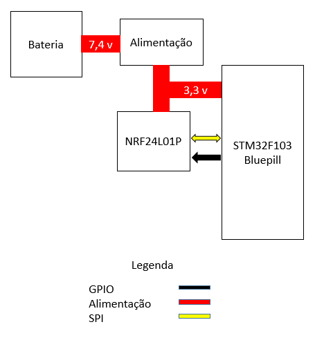

# Projeto de Microcontroladores

##### Aluno: João Bacelar

### Conceito do projeto
Projeto de firmmware para o microcontrolador STM32F103C8 de maneira à estabelecer comunicação com outro microcontrolador através de um rádio nrf24l01p. Sendo capaz de receber e enviar pacotes de dados via ondas RF. 

### Função

O projeto tem como função utilizar-se do rádio nrf24l01p para estabelecer a comunicação entre robôs de um time de futebol da categoria VSS e um computador rodando os códigos de inteligência, responsável pela tomada de decisões de estados e movimentação do robô. Assim as velocidades desejadas em cada uma das duas rodas do robô a cada ciclo de controle será passada via pacotes por um segundo microcontrolador com um nrf24 em modo de transmissão, que por sua vez recebe os dados do PC via USB.

### Motivação

Uma maneira eficiente de transmitir dados diferentes de um mesmo transmissor para múltiplos receptores sem fio é através de um rádio nrf24l01p. A necessidade de estabelecer o envio das velocidades calculadas pela inteligência para os robôs de maneira rápida e diferente para cada robô motivou ao desenvolvimento do firmmware para utilização do radio.

### Diagrama de Blocos e Fluxograma

A comunicação entre o rádio e o microcontrolador é através do protocolo SPI, usando o periférico SPI do microcontrolador. O código para a recepção ou envio de dados é executado em uma task default de um firmmware com FreeRTOS.

##### Diagrama de Blocos da eletrônica:

##### Pinagem:
Tabela com os pinos correspondentes no microcontrolador.
| Pino | STM32F103 |
|:----:|:---------:|
| NIRQ |    PA10   |
|  CE  |    PA15   |
|  NSS |    PB12   |
| MOSI |    PB15   |
| MISO |    PB14   |
|  SCK |    PB13   |

##### Fluxograma do Firmware:

### Documentação das funções e classes
##### IO_Pin_smt32:
Classe que trata os GPIOs. Herda a classe virtual IO_Pin, e possui como atributos: IO_Pin_Mode ,GPIO_TypeDef e GPIO_Pin.
Nela são implementadas os métods simples para GPIO:
* Set();
* Reset();
* Write(uint8_t value);
* Read();
* GetIRQChannel();
* Interrupt(uint8_t newstate);
##### Spi_stm32:
Classe que trata do SPI, herdando a classe IO_pin_smt32. Tem como atributos o pino de SS e o Handle TypeDef para SPI.
Nela são implementadas alguns métodos importantes para SPI como:
* Assert(): SS pin reset;
* Release(): SS pin set;
* WriteBuffer(uint8_t* buffer, uint16_t size): Transmite e recebe via SPI, os parâmetros são para a transmissão, já a resposta do slave é obtida através da resposta da função;

##### NRF24L01P:
Classe que trata do interfaceamento com o nrf24, herda a classe anterior. Tem como atributo todos os pinos usados para comunicação com nrf24, classe IO_Pin, dois buffers circulares para tratar os dados de transmissão(TX) e recepção(RX), o handle  typedef para o SPI, canal, enum para os comandos disponíveis para o radio, e structs para os registradores.

Alguns métodos são importantes e valem a apresentação:
* NRF24L01P::InterruptCallback(): trata os procedimentos após uma ativação, em níve baixo, do NIRQ. Verifica que condição está:  Se Data ready para leitura ou RX FIFO não vazio,Data sent ou TX vazio com busy=1 (transmissão), TX FULL e finaliza um ciclo de transmissão ou recepção ;
*  NRF24L01P::StartRX_ESB(uint8_t channel, uint64_t address, uint16_t size, uint8_t en_auto_ack): configurações de recepção;
*  NRF24L01P::Config(): configurações gerais dos registradores, ajustando modos e preferências;
* NRF24L01P::Init(): inicialização, ou reset do nrf;

Existem ainda os métodos de write e read para SPI, que enviam comandos e fazem leitura dos registradores do nrf24. Mais informações sobre outras funções estão comentadas no código.

### Vídeo do projeto

### Referências:
* [Datasheet do NRF24L01P](https://www.sparkfun.com/datasheets/Components/SMD/nRF24L01Pluss_Preliminary_Product_Specification_v1_0.pdf)

* [Datasheet do SMT32F103](http://www.st.com/content/ccc/resource/technical/document/datasheet/33/d4/6f/1d/df/0b/4c/6d/CD00161566.pdf/files/CD00161566.pdf/jcr:content/translations/en.CD00161566.pdf)

* Firmware da equipe SSL da RoboIME

* Cap Renault

* Al Onias 

